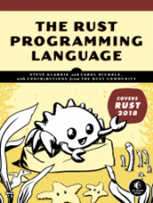

# rust-lang-grep

## An I/O Project: Building a Command Line Program

> Cover Image from [no starch press](https://nostarch.com/Rust2018)

This is the demo project from the book ['The Rust Programming Language'](https://doc.rust-lang.org/book/title-page.html#the-rust-programming-language) _by Steve Klabnik and Carol Nichols, with contributions from the Rust Community_.

## Contents

- Explore step-by-step [commits](https://github.com/gratiaa/rust-lang-grep/network)

### 12-1. Accepting Command Line Arguments

- [Book Link](https://doc.rust-lang.org/book/ch12-02-reading-a-file.html)

### 12-2. Reading a File

- [Book Link](https://doc.rust-lang.org/book/ch12-02-reading-a-file.html)

### 12-3. Refactoring to Improve Modularity and Error Handling

- [Book Link](https://doc.rust-lang.org/book/ch12-03-improving-error-handling-and-modularity.html)

### 12-4. Developing the Library’s Functionality with Test-Driven Development

- [Book Link](https://doc.rust-lang.org/book/ch12-04-testing-the-librarys-functionality.html)

### 12-5. Working with Environment Variables

- [Book Link](https://doc.rust-lang.org/book/ch12-05-working-with-environment-variables.html)

### 12-6. Writing Error Messages to Standard Error Instead of Standard Output

- [Book Link](https://doc.rust-lang.org/book/ch12-06-writing-to-stderr-instead-of-stdout.html)
